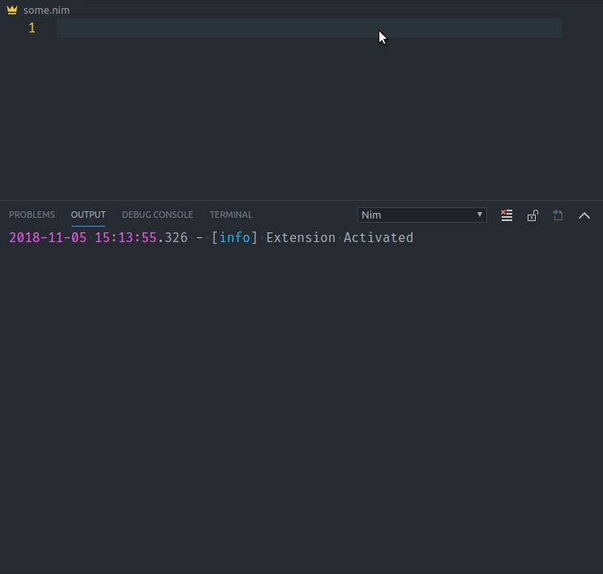

# Nim for Visual Studio Code

[](https://marketplace.visualstudio.com/items?itemName=kosz78.nim)
[](https://marketplace.visualstudio.com/items?itemName=kosz78.nim)
[](https://vsmarketplacebadge.apphb.com/rating/kosz78.nim.svg)
[](https://travis-ci.org/pragmagic/vscode-nim)

This extension adds language support for the Nim language to VS Code, including:

- Syntax Highlight (nim, nimble, nim.cfg)
- Code Completion
- Signature Help
- Goto Definition
- Find References
- File outline
- Build-on-save
- Workspace symbol search
- Quick info
- Nim check result reported in `Nim` output channel (great for macro development).



## Using

First, you will need to install Visual Studio Code `0.10`.
In the command palette (`cmd-shift-p`) select `Install Extension` and choose `Nim`.

The following tools are required for the extension:
* Nim compiler - http://nim-lang.org

_Note_: It is recommended to turn `Auto Save` on in Visual Studio Code (`File -> Auto Save`) when using this extension.

### Options

The following Visual Studio Code settings are available for the Nim extension.  These can be set in user preferences (`cmd+,`) or workspace settings (`.vscode/settings.json`).
* `nim.buildOnSave` - perform build task from `tasks.json` file, to use this options you need declare build task according to [Tasks Documentation](https://code.visualstudio.com/docs/editor/tasks), for example:
	```json
	{
	   "taskName": "Run module.nim",
	   "command": "nim",
	   "args": ["c", "-o:bin/${fileBasenameNoExtension}", "-r", "${fileBasename}"],
	   "options": {
	      "cwd": "${workspaceRoot}"
	   },
	   "type": "shell",
	   "group": {
	      "kind": "build",
	      "isDefault": true
	   }
	}
	```
* `nim.lintOnSave` - perform the project check for errors on save
* `nim.project` - optional array of projects file, if nim.project is not defined then all nim files will be used as separate project
* `nim.licenseString` - optional license text that will be inserted on nim file creation


#### Example

```json
{
	"nim.buildOnSave": false,
	"nim.buildCommand": "c",
	"nim.lintOnSave": true,
	"nim.project": ["project.nim", "project2.nim"],
	"nim.licenseString": "# Copyright 2017.\n\n"
}
```

### Commands
The following commands are provided by the extension:

* `Nim: Run selected file` - compile and run selected file, it uses `c` compiler by default, but you can specify `cpp` in `nim.buildCommand` config parameter.
This command available from file context menu or by `F6` keyboard shortcut.

## TODO

* Rename support
* Debug support

## ChangeLog

ChangeLog is located [here](https://github.com/pragmagic/vscode-nim/blob/master/CHANGELOG.md)

